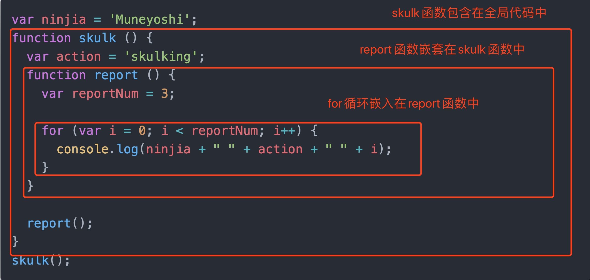
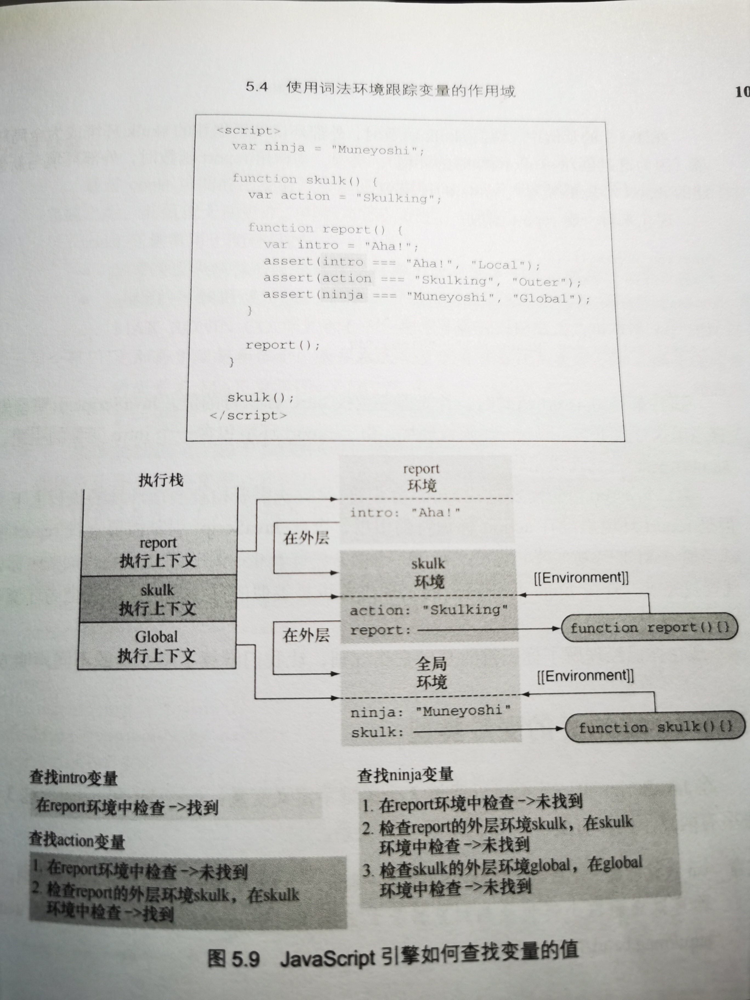
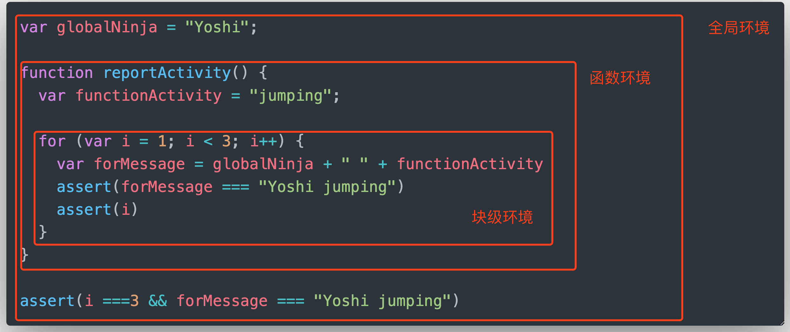

# 第 5 章-精通函数-闭包和作用域

使用闭包不仅可以通过减少代码数量和复杂度来添加高级特性，还能实现不太可能完成的功能。如果没有闭包，事件处理和动画等包含回调函数的任务，它们的实现将变得复杂得多。除此之外，如果没有闭包，将完全不可能实现私有变量。

> 闭包允许函数访问并操作函数外部的变量。

## 理解闭包

一个简单的闭包

```javascript
var outerValue = "ninjia";
function outerFunction() {
  assert(outerValue === "ninjia");
}
outerFunction();
```

这就是在创建一个闭包，该函数可以“看见”并访问变量 outerValue。因为外部变量 outerValue 和外部函数 outerFunction 都是在全局作用域中声明的，该作用域（实际上就是一个闭包）从未消失（只要应用处于运行状态）。

另一个闭包的例子

```javascript
var outerValue = "samurai";
var later;

function outerFunction() {
  var innerValue = "ninjia";

  function innerFunction() {
    assert(outerValue === "samurai");
    assert(innerValue === "ninjia");
  }

  later = innerfunction;
}

outerFunction();

later();
```

`assert(outerValue === 'samurai'); // true`

`assert(innerValue === 'ninjia'); // true`

正如保护气泡一样，只要内部函数一直存在，`内部函数的闭包`就一直保存这该函数的作用域中的变量。

> 存储和引用这些信息会直接影响性能。谨记每一个通过闭包访问变量的函数都具有一个作用域链，作用域链包含闭包的全部信息，这一点非常重要。因此，虽然闭包是非常有用的，但不能过度使用。使用闭包时，所有的信息都会存储在内存中，直到 JavaScript 引擎确保这些信息不再使用（可以安全地进行垃圾回收）或页面卸载时，才会清理这些信息。

## 使用闭包

### 封装私有变量

原生 JavaScript 不支持私有变量。但是，通过使用闭包我们可以实现很接近、可接受的私有变量。

使用闭包模拟私有变量

```javascript
function Ninja() {
  var feints = 0;
  this.getFeints = function () {
    return feints;
  };
  this.feints = function () {
    feints++;
  };
}

var ninjia1 = new Ninja();
ninjia1.feints();

assert(ninjia1.feints === undefined);
assert(ninjia1.getFeints() === 1);

var ninjia2 = new Ninja(); // 有自己的私有就变量feints
assert(ninjia2.getFeints() === 0);
```

虽然我们无法直接通过对 feints 变量复赋值，但是我们仍然能够通过 getFeints 方法操作该变量的值。

通过测试显示，可通过闭包内部方法获取私有变量的值，但是不能直接访问私有变量。这有效地阻止了读取读私有变量不可控的修改。

### 回调函数

处理回调函数是另一种常见的使用闭包的情景。回调函数指的是需要在将来不确定的某一时刻异步调用的函数。通常，在这种回调函数中，我们经常需要频繁地访问外部数据。

```html
<div id="box1">First Box</div>
<script>
  function animateIt(elementId) {
    var elem = document.getElementById(elementId);
    var tick = 0;
    var timer = setInterval(function () {
      if (tick < 100) {
        elem.style.left = elem.style.top = tick + "px";
        tick++;
      } else {
        clearInterval(timer);
        assert(tick === 100);
      }
    }, 10);
  }

  animateIt("box1");
</script>
```

通过在函数内部定义变量，并基于闭包，使得在计时器的回调函数中可以访问这些变量，每个动画都能获得属于自己的“气泡”中的私有变量。

闭包内的函数不仅可以在创建的时刻访问这些变量，而且当闭包内部的函数执行时，还可以修改这些变量的值。闭包不是在创建的那一时刻的状态快照，而是一个真实的状态封装，只要闭包存在，就可以对变量进行修改。

> 闭包与作用域强相关

## 通过执行上下文来跟踪代码

JavaScript 代码有两种类型，一种全局代码，在所有函数的外部定义；一种是函数代码，位于函数内部。JavaScript 引擎执行代码时，每一条都处于特定的执行上下文。

既然具有两种类型的代码，那么就有两种执行上下文；全局执行上下文和函数执行上下文。二者最重要的差别是：全局执行上下文只有一个，当 JavaScript 程序开始执行时就已经创建了全局执行上下文，而函数执行上下文是在每次调用函数时，就会创建一个新的。

> JavaScript 基于单线程的执行模型：在某个特定的时刻只能执行特定的代码。一旦发生函数调用，当前的执行上下文必须停止执行，并创建新的函数执行上下文来执行函数。当函数执行完成后，将函数执行上下文销毁，并重新回到发生调用时的执行上下文中。所以需要跟踪执行上下文--正在执行的上下文以及正在等待的上下文。最简单的跟踪方法是使用执行上下文栈（或称为调用栈）。

> 栈是一种基本的数据结构，先进后出。


## 使用词法环境跟踪变量的作用域

词法环境（lexical environment）是 JavaScript 引擎内部用来跟踪标识符与特定变量之间的映射关系。

```javascript
var ninjia = "Hattori";
console.log(ninjia);
```

当 console.log 语句访问 ninjia 变量时，会进行词法环境的查询。

> 注意：词法环境是 JavaScript 作用域的内部实现机制，通常称为作用域（scopes）

### 代码嵌套

词法环境主要基于代码嵌套，通过代码嵌套可以实现代码结构包含另一代码结构。

```javascript
var ninjia = "Muneyoshi";
function skulk() {
  var action = "skulking";
  function report() {
    var reportNum = 3;

    for (var i = 0; i < reportNum; i++) {
      console.log(ninjia + " " + action + " " + i);
    }
  }

  report();
}
skulk();
```



### 代码嵌套与词法环境

除了跟踪局部变量、函数声明、函数的参数和词法环境外，还有必要跟踪外部（父级）词法环境。因为我们需要访问外部代码结构中的变量，如果在当前环境中无法找到某一标识符，就会对外部环境进行查找。一旦查找到匹配的变量，或是全局环境中仍然无法查找对应的标识符而返回错误，就会停止查找。

> 每个执行上下文都有一个与之关联的词法环境，词法环境中包含了在上下文中定义的标识

无论何时创建函数，都会创建一个与之关联的词法环境，并存储在名为`[[Environment]]`的内部属性上
（也就是说无法直接访问或操作）



## 理解 JavaScript 的变量类型

在 JavaScript 中，可以通过 3 个关键字定义变量：var、let 和 const。这 3 个关键字有两点不同：可变性，与词法环境的关系。

### 变量可变性

如果通过变量的可变性来进行分类，那么可以将 const 放在一组，var 和 let 放在一组。通过 const 定义的变量都不可变，也就是说通过 const 声明的变量的值只能设置一次。通过 var 或 let 声明的变量的值可以变更任意次数。

- const 变量
  - 由于在程序执行过程中不允许对 const 变量重新赋值，这可以避免代码发生不必要的变更，同时也为 JavaScript 引擎性能优化提供便利
  - const 变量一个重要的特性，不能将一个全新的值赋值给 const 变量，但是，我们可以修改 const 变量已有的对象

### 定义变量的关键字与词法环境

定义变量的 3 个关键字--var、let 与 const，还可以通过与词法环境的关系将其进行分类（换句话说，按照作用域分类）：可以将 var 分为一组，let 与 const 分为一组

#### 使用关键字 var

> 当使用关键字 var 时，该变量是在距离最近的函数内部或是在全局词法环境中定义的。（注意：忽略块级作用域）这是 JavaScript 由来已久的特性

```javascript
var globalNinja = "Yoshi";

function reportActivity() {
  var functionActivity = "jumping";

  for (var i = 1; i < 3; i++) {
    var forMessage = globalNinja + " " + functionActivity;
    assert(forMessage === "Yoshi jumping");
    assert(i);
  }

  assert(i === 3 && forMessage === "Yoshi jumping");
}

reportActivity();
```

for 循环外部，仍然能访问 for 循环中定义的变量

> 这源于通过 var 声明的变量实际上总是在距离最近的函数内或全局词法环境中注册的，不关注块级作用域



> for 循环的块级作用域，关键字 var 定义的变量忽略忽略块级作用域

#### 使用 let 与 const 定义具有块级作用域的变量

var 是在距离最近的函数或全局词法环境中定义变量，与 var 不同的是，`let与const更加直接。let与const直接在最近的词法环境中定义变量（可以是在块级作用域内、循环内、函数内或全局环境内）`。我们可以使用 let 和 const 定义块级别、函数级别、全局级别的变量

```javascript
var GLOBAL_NINJA = "Yoshi";

function reportActivity() {
  var functionActivity = "jumping";

  for (let i = 1; i < 3; i++) {
    // 在for循环中，毫无意外地可以访问块级变量，函数变量和全局变量
    var forMessage = GLOBAL_NINJA + " " + functionActivity;
    assert(forMessage === "Yoshi jumping");
    assert(i);
  }

  // for循环外部无法访问for循环内部的变量
  assert(typeof i === "undefined" && typeof forMessage === "undefined");
}

reportActivity();
```

### 在词法环境中注册标识符

#### 注册标识符的过程

JavaScript 代码的执行事实上是分两个阶段进行的。

> 一旦创建了新的词法环境，就会执行第一阶段。在第一阶段，没有执行代码，但是 JavaScript 引擎会访问并注册在当前词法环境中所有声明的变量和函数。JavaScript 在第一阶段完成之后开始执行第二阶段，具体如何执行取决于变量的类型（let、var、const 和函数声明）以及环境类型（全局环境、函数环境或块级环境）

具体的处理过程如下

- 如果创建一个函数环境，那么创建形参及函数参数的默认值。如果是非函数环境，将跳过此步骤
- 如果是创建全局或函数环境，就扫描当前代码进行函数声明（不会扫描其他函数的函数体），但是不会执行函数表达式或箭头函数。对于所找到的函数声明，将创建函数，并绑定到当前环境与函数名相同的标识符上。若该标识符已经存在，那么该标识符的值将被重写。如果是块级作用域，将跳过此步骤
- 扫描当前代码进行变量声明。在函数或全局环境中，查找所有当前函数以及其他函数之外通过 var 声明的变量，并查找所有通过 let 或 const 定义的变量。在块级作用域中，仅查找当前块中通过 let 或 const 定义的变量。对于所查找到的变量，若该标识符不存在，进行注册并将其初始化为 undefined。若该标识符已经存在，将保留其值

#### 在函数声明之前调用函数

第二阶段表明函数已经通过函数声明进行定义，在当前词法环境创建时已在其他代码执行之前注册了函数标识符。

## 研究闭包的工作原理

### 回顾使用闭包模拟私有变量的代码

闭包可以访问创建函数时所在作用域内的全部变量。闭包与作用域密切相关，闭包对 JavaScript 的作用域规则产生了直接影响。

```javascript
function Ninja() {
  var feints = 0;
  this.getFeints = function () {
    return feints;
  };
  this.feints = function () {
    feints++;
  };
}

var ninjia1 = new Ninja();
ninjia1.feints();

assert(ninjia1.feints === undefined);
assert(ninjia1.getFeints() === 1);

var ninjia2 = new Ninja(); // 有自己的私有就变量feints
assert(ninjia2.getFeints() === 0);
```

我们可以利用标识符原理来更好地理解这种情况下闭包的工作原理。通过关键字 new 调用 JavaScript 构造函数。因此，每次调用构造函数时，都会创建一个新的词法环境，该词法环境保持构造函数内部的局部变量。

在本例中。Ninja 构造函数内部，我们创建了两个函数：getFeints 与 feint，均有 Ninja 环境的引用，因为 Ninja 环境是这两个函数创建时所处的环境。

getFeints 与 feints 函数是新创建的 ninjia 的对象方法。因此，可以通过 Ninja 构造函数外部访问 getFeints 与 feints 函数，这样实际上就创建 feints 变量的闭包。

每一个通过 Ninja 构造函数创建的对象实例均获得了各自的方法，各自的“私有变量”。

### 私有变量的警告

JavaScript 从未阻止我们将一个对象中创建的属性复制给另一个对象。

```javascript
function Ninja() {
  var feints = 0;
  this.getField = function () {
    return feints;
  };

  this.feints = function () {
    feints++;
  };
}

var ninjia1 = new Ninja();
ninjia1.feints();

var imposter = {};
imposter.getField = ninjia1.getField; // 引用，getField函数还是包含Ninja作用域的内容

console.log(imposter.getField()); // 1

assert(imposter.getField() === 1);
```

本例子表明了在 JavaScript 中没有真正的私有对象属性，但是可以通过闭包实现一种可接受的“私有”变量的方案。尽管如此，虽然不是真正的私有变量，但是许多开发者发现这是一种隐藏信息的有用方式。
