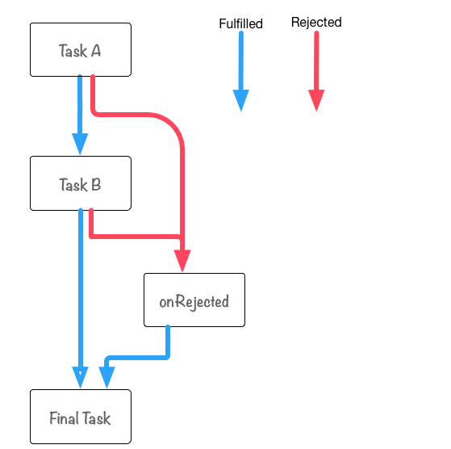

# Promise

> 参考链接
>
> - [JavaScript Promise 迷你书（中文版）](http://liubin.org/promises-book/)
> - [使用 Promise](https://developer.mozilla.org/zh-CN/docs/Web/JavaScript/Guide/Using_promises)
> - [async function](https://developer.mozilla.org/zh-CN/docs/Web/JavaScript/Reference/Statements/async_function)
> - [并发模型与事件循环](https://developer.mozilla.org/zh-CN/docs/Web/JavaScript/EventLoop)

## 什么是 Promise

Promise 是抽象异步处理对象以及对其进行各种操作的组件。Promise 并不是从 JavaScript 中发祥的概念。

Promise 最初被提出是在 E 语言中，它是基于并列和并行处理设计的一种编程语言。

说到基于 JavaScript 的异步处理，大多数都会想到利用回调函数。

```javascript
getAsync("fileA.txt", function (error, result) {
  if (error) {
    throw error;
  }
});
```

Node.js 等则规定在 JavaScript 的回调函数的第一个参数为 Error 对象，这也是它的一个惯例。

Promise 是把类似的异步处理对象和处理规则进行规范化。并按照采用统一的接口来编写，而采取规定方法之外的写法都会出错。

```javascript
var promise = getAsyncPromise("fileA.txt"); // 返回Promise对象
promise
  .then(function (result) {
    // TODO:
  })
  .catch(function (err) {
    // TODO:
  });
```

可以向这个预设了抽象化异步处理的 promise 对象，注册这个 promise 对象执行成功时和失败时相应的回调函数。

这和回调函数方式相比有哪些不同之处呢？在使用 promise 进行一步处理的时候，我们必须按照接口规定的方法编写处理代码。

也就是说，除 promise 对象规定的方法(这里的`then`或`catch`)以外的方法都是不可以使用的，而不会像回调函数方式那样可以自己自由的定义回调函数的参数，而必须严格遵守固定、统一的编程方式来编写代码。

> 所以，promise 的功能是可以将复杂的异步处理轻松地进行模式化， 这也可以说得上是使用 promise 的理由之一。

## Promise 简介

API

### Constructor

Promise 类似于 XMLHttpRequest，从构造函数 Promise 来创建一个 promise 对象作为接口。

使用 new 来调用 Promise 的构造器来进行实例化。

```javascript
var promise = new Promise(function (resolve, reject) {
  // TODO: 异步处理
  // 处理结束后、调用resolve或reject
});
```

### Instance Method

对通过 new 生成的 promise 对象为了设置其值在 resolve(成功)/reject(失败)时调用的回调函数，可以使用`promise.then()`实例方法。

```javascript
promise.then(onFulfilled, onRejected);
```

- `resolve()`成功时 onFulfilled 会被调用
- `reject()`失败时 onRejected 会被调用

`onFulfilled和onRejected两个都为可选参数`

promise.then 成功和失败时都可以使用。另外在只想对异常进行处理时可以采用 promise.then(undefined, onRejected)这种方式，只指定 reject 时的回调函数即可。`不过这种情况下promise.catch(onRejected)应该是个更好的选择`。

```javascript
promise.catch(onRejected);
```

### Static Method

像 Promise 这样的全局对象还拥有一些静态方法。

包括`Promise.all()`还有`Promise.resolve`等在内。

## Promise workflow

```javascript
function asyncFunction() {
  return new Promise(function (resolve, reject) {
    setTimeout(function () {
      resolve("Async Hello World");
    }, 16);
  });
}

asyncFunction()
  .then(function (value) {
    console.log(value);
  })
  .catch(function (error) {
    console.log(error);
  });
```

asyncFunction 这个函数返回 promise 对象，then 方法设置 resolve 后回调函数，catch 方法设置 reject 回调函数。

该 promise 对象会在 setTimeout 之后的 16ms 时被 resolve，then 回调函数会被调用，输入'Async Hello world'。

在这种情况下 catch 的回调函数并不会被执行（因为返回了 resolve），不过如果运行环境没有提供 setTimeout 函数的，那么上面的代码执行中就会产生异常，cathy 设置的回调函数就会被执行。

## Promise 的状态

用 new Promise 实例化的 promise 对象有以下三个状态。

- `has-resolution` - Fulfilled：resolve(成功)时调用 onFulfilled
- `has-rejection` - Rejected：reject(失败)时调用 onRejected
- `unresolved` - Pending：既不是 resolve 也不是 reject 的状态。也就是 promise 对象刚被创建后的初始化状态等。

> promise 对象的状态，从 Pending 转换为 Fulfilled 或 Rejected 之后，这个 promise 对象的状态就不会再发生任何变化。

另外，Fulfilled 和 Rejected 这两个中的任一状态都可以表示为 Settled（不变的）。

Settled：resolve 或 reject

## 编写 Promise 代码

创建 XHR 的 promise 对象

```javascript
// xhr-promise.js
function getURL(URL) {
  return new Promise(function (resolve, reject) {
    var req = new XMLHttpRequest();
    req.open("GET", URL, true);
    req.onload = function () {
      if (req.status === 200) {
        resolve(req.responseText);
      } else {
        reject(new Error(req.statusText));
      }
    };
    req.onerror = function () {
      reject(new Error(req.statusText));
    };
    req.send();
  });
}

// 运行示例
var URL = "http://httpbin.org/get";
getURL(URL)
  .then(function onFulfilled(value) {
    console.log(value);
  })
  .catch(function onRejected(error) {
    console.error(error);
  });
```

## 实战 Promise

### Promise.resolve

一般情况下我们都会使用 new Promise()来创建 promise 对象，但是除此之外我们也可以使用其他方法。

在这里，我们将会学习如何使用 Promise.resolve 和 Promise.reject 这两个方法。

静态方法 Promise.resolve(value)可以认为是 new Promise()方法的快捷方式。

比如`Promise.resolve(42)`; 可以认为是以下代码的语法糖。

```javascript
new Promise(function (resolve) {
  resolve(42);
});
```

### Thenable

Promise.resolve 方法另一个作用就是将 thenable(类 Promise 对象。 拥有名为.then 方法的对象) 对象转换为 promise 对象。

```javascript
// 将thenable对象转换promise对象
var promise = Promise.resolve($.ajax("/json/comment.json")); // => promise对象
promise.then(function (value) {
  console.log(value);
});
```

### Promise.reject

Promise.reject(error)是和 Promise.resolve(value)类似的静态方法，是 new Promise()方法的快捷方式。

比如 Promise.reject(new Error("出错了"))就是下面代码的语法糖形式。

```javascript
new Promise(function (resolve, reject) {
  reject(new Error("出错了"));
});
```

## 专栏: Promise 只能进行异步操作？

在使用 Promise.resolve(value)等方法的时候，如果 promise 对象立刻就能进入 resolve 状态的话，那么你是不是觉得 then 里面指定的方法就是同步调用的呢？

实际上， `.then`中指定的方法调用是异步进行的。

```javascript
var promise = new Promise(function (resolve) {
  console.log("inner promise"); // 第一步
  resolve(42);
});

promise.then(function (value) {
  console.log(value); // 第三步
});

console.log("outer promise"); // 第二步

// 输出顺序
// inner promise // 1
// outer promise // 2
// 42            // 3
```

由于 JavaScript 代码会按照文件的从上到下的顺序执行，所以最开始<1>会执行，然后是 resolve(42); 被执行。这时候 promise 对象的已经变为确定状态，FulFilled 被设置为了 42 。

下面的代码 promise.then 注册了<3>这个回调函数，这是本专栏的焦点问题。

由于 promise.then 执行的时候 promise 对象已经是确定状态，从程序上说对回调函数进行同步调用也是行得通的。

> 但是即使在调用 promise.then 注册回调函数的时候 promise 对象已经是确定的状态，Promise 也会以异步的方式调用该回调函数，这是在 Promise 设计上的规定方针。

因此<2>会最先被调用，最后才会调用回调函数<3> 。

为什么要对明明可以以同步方式进行调用的函数，非要使用异步的调用方式呢？

### 同步调用和异步调用同时存在导致的混乱

其实在 Promise 之外也存在这个问题，这里我们以一般的使用情况来考虑此问题。

这个问题的本质是接收回调函数的函数，会根据具体的执行情况，可以选择是以同步还是异步的方式对回调函数进行调用。

```javascript
function onReady(fn) {
  var readyState = document.readyState;
  if (readyState === "interactive" || readyState === "complete") {
    fn();
  } else {
    window.addEventListener("DOMContentLoaded", fn);
  }
}
onReady(function () {
  console.log("DOM fully loaded and parsed");
});
console.log("==Starting==");

// DOM fully loaded and parsed
// ==Starting==
```

- 如果在调用 onReady 之前 DOM 已经载入的话
  - 对回调函数进行同步调用
- 如果在调用 onReady 之前 DOM 还没有载入的话
  - 通过注册 DOMContentLoaded 事件监听器来对回调函数进行异步调用

因此，如果这段代码在源文件中出现的位置不同，在控制台上打印的 log 消息顺序也会不同。

为了解决这个问题，我们可以选择统一使用异步调用的方式。

```javascript
// async-onready.js
function onReady(fn) {
  var readyState = document.readyState;
  if (readyState === "interactive" || readyState === "complete") {
    setTimeout(fn, 0);
  } else {
    window.addEventListener("DOMContentLoaded", fn);
  }
}

onReady(function () {
  console.log("DOM fully loaded and parsed");
});

console.log("==Starting==");

// ==Starting==
// DOM fully loaded and parsed
```

> 关于这个问题，不要对异步回调函数进行同步调用
>
> - 绝对不能对异步回调函数（即使在数据已经就绪）进行同步调用。
> - 如果对异步回调函数进行同步调用的话，处理顺序可能会与预期不符，可能带来意料之外的后果。
> - 对异步回调函数进行同步调用，还可能导致栈溢出或异常处理错乱等问题。
> - 如果想在将来某时刻调用异步回调函数的话，可以使用 setTimeout 等异步 API。

前面我们看到的 promise.then 也属于此类，为了避免上述中同时使用同步、异步调用可能引起的混乱问题，`Promise在规范上规定Promise只能使用异步调用方式`。

```javascript
// 重写onready-as-promise.js
function onReadyPromise() {
  return new Promise(function (resolve, reject) {
    var readyState = document.readyState;
    if (readyState === "interactive" || readyState === "complete") {
      resolve();
    } else {
      window.addEventListener("DOMContentLoaded", resolve);
    }
  });
}

onReadyPromise().then(function () {
  console.log("DOM fully loaded and parsed");
});
console.log("==Starting==");

// ==Starting==
// DOM fully loaded and parsed
```

> 由于 Promise 保证了每次调用都是以异步方式进行的，所以我们在实际编码中不需要调用 setTimeout 来自己实现异步调用。

## Promise#then

大家已经认识了.then().catch()这种链式方法的写法了，其实在 Promise 里可以将任意个方法连在一起作为一个方法链（method chain）。

```javascript
// promise可以写成方法链的形式
aPromise
  .then(function taskA(value) {
    // task A
  })
  .then(function taskB(vaue) {
    // task B
  })
  .catch(function onRejected(error) {
    console.log(error);
  });
```

如果把在 then 中注册的每个回调函数称为 task 的话，那么我们就可以通过 Promise 方法链方式来编写能以 taskA→taskB 这种流程进行处理的逻辑了。

Promise 方法链这种叫法有点长（其实是在日语里有点长，中文还可以 --译者注），因此后面我们会简化为 promise chain 这种叫法。

Promise 之所以适合编写异步处理较多的应用，promise chain 可以算得上是其中的一个原因吧。

## promise chain

> promise chain - 即方法链越短越好。 在这个例子里我们是为了方便说明才选择了较长的方法链。

```javascript
// promise-then-catch-flow.js
function taskA() {
  console.log("Task A");
}
function taskB() {
  console.log("Task B");
}
function onRejected(error) {
  console.log("Catch Error: A or B", error);
}
function finalTask() {
  console.log("Final Task");
}

var promise = Promise.resolve();
promise.then(taskA).then(taskB).catch(onRejected).then(finalTask);
```



这些线的意思是在 Task A 或 Task B 的处理中，在下面的情况下就会调用 onRejected 方法。

- 发生异常的时候
- 返回了一个 Rejected 状态的 promise 对象

> Promise 中的处理习惯上都会采用 try-catch 的风格，当发生异常的时候，会被 catch 捕获并被由在此函数注册的回调函数进行错误处理。

另一种异常处理策略是通过返回一个 Rejected 状态的 promise 对象来实现的，这种方法不通过使用 throw 就能在 promise chain 中对 onRejected 进行调用。

> 此外在 promise chain 中，由于在 onRejected 和 Final Task 后面没有 catch 处理了，因此在这两个 Task 中如果出现异常的话将不会被捕获，这点需要注意一下。

### promise chain 中如何传递参数

前面例子中的 Task 都是相互独立的，只是被简单调用而已。

这时候如果 Task A 想给 Task B 传递一个参数该怎么办呢？

答案非常简单，那就是在 Task A 中 return 的返回值，会在 Task B 执行时传给它。

```javascript
// promise-then-passing-value.js
function doubleUp(value) {
  return value * 2;
}

function increment(value) {
  return value + 1;
}

function output(value) {
  console.log(value); // => (1 + 1) * 2
}

var promise = Promise.resolve(1);
promise
  .then(increment)
  .then(doubleUp)
  .then(output)
  .catch(function (error) {
    // promise chain中出现异常的时候会被调用
    console.error(error);
  });
```

> 每个方法中 return 的值不仅只局限于字符串或者数值类型，也可以是对象或者 promise 对象等复杂类型。
>
> return 的值会由 Promise.resolve(return 的返回值);进行相应的包装处理，因此不管回调函数中会返回一个什么样的值，最终 then 的结果都是返回一个新创建的 promise 对象。

## Promise#catch

实际上 Promise#catch 只是 promise.then(undefined, onRejected);方法的一个别名而已。也就是说，这个方法用来注册当 promise 对象状态变为 Rejected 时的回调函数。

## 专栏: 每次调用 then 都会返回一个新创建的 promise 对象

实际上不管是 then 还是 catch 方法调用，都返回了一个新的 promise 对象。

下面我们就来看看如何确认这两个方法返回的到底是不是新的 promise 对象。

```javascript
var aPromise = new Promise(function (resolve) {
  resolve(100);
});
var thenPromise = aPromise.then(function (value) {
  console.log(value);
});
var catchPromise = thenPromise.catch(function (error) {
  console.error(error);
});
console.log(aPromise !== thenPromise); // => true
console.log(thenPromise !== catchPromise); // => true
```

`===`是严格相等比较运算符，我们可以看出这三个对象都是互不相同的，这也就证明了 then 和 catch 都返回了和调用者不同的 promise 对象。

我们在对 Promise 进行扩展的时候需要牢牢记住这一点，否则稍不留神就有可能对错误的 promise 对象进行了处理。

如果我们知道了 then 方法每次都会创建并返回一个新的 promise 对象的话，那么我们就应该不难理解下面代码中对 then 的使用方式上的差别了。

```javascript
// 1: 对同一个promise对象同时调用 `then` 方法
var aPromise = new Promise(function (resolve) {
  resolve(100);
});
aPromise.then(function (value) {
  return value * 2;
});
aPromise.then(function (value) {
  return value * 2;
});
aPromise.then(function (value) {
  console.log("1: " + value); // => 100
});

// vs

// 2: 对 `then` 进行 promise chain 方式进行调用
var bPromise = new Promise(function (resolve) {
  resolve(100);
});
bPromise
  .then(function (value) {
    return value * 2;
  })
  .then(function (value) {
    return value * 2;
  })
  .then(function (value) {
    console.log("2: " + value); // => 100 * 2 * 2
  });
```

## Promise 和数组

如果只有一个 promise 对象的话我们可以像前面介绍的那样编写代码就可以了，如果要在多个 promise 对象都变为 FulFilled 状态的时候才要进行某种处理话该如何操作呢？

我们以当所有 XHR（异步处理）全部结束后要进行某操作为例来进行说明。

### 通过回调方式来进行多个异步调用

```javascript
// multipe-xh-callback.js
function getURLCallback(URL, callback) {
  var req = new XMLHttpRequest();
  req.open("GET", URL, true);
  req.onload = function () {
    if (req.status === 200) {
      callback(null, req.responseText);
    } else {
      callback(new Error(req.statusText), req.response);
    }
  };
  req.onerror = function () {
    callback(new Error(req.statusText));
  };
  req.send();
}
// <1> 对JSON数据进行安全的解析
function jsonParse(callback, error, value) {
  if (error) {
    callback(error, value);
  } else {
    try {
      var result = JSON.parse(value);
      callback(null, result);
    } catch (e) {
      callback(e, value);
    }
  }
}
// <2> 发送XHR请求
var request = {
  comment: function getComment(callback) {
    return getURLCallback(
      "http://azu.github.io/promises-book/json/comment.json",
      jsonParse.bind(null, callback)
    );
  },
  people: function getPeople(callback) {
    return getURLCallback(
      "http://azu.github.io/promises-book/json/people.json",
      jsonParse.bind(null, callback)
    );
  },
};
// <3> 启动多个XHR请求，当所有请求返回时调用callback
function allRequest(requests, callback, results) {
  if (requests.length === 0) {
    return callback(null, results);
  }
  var req = requests.shift();
  req(function (error, value) {
    if (error) {
      callback(error, value);
    } else {
      results.push(value);
      allRequest(requests, callback, results);
    }
  });
}
function main(callback) {
  allRequest([request.comment, request.people], callback, []);
}
// 运行的例子
main(function (error, results) {
  if (error) {
    return console.error(error);
  }
  console.log(results);
});
```

这段回调函数风格的代码有以下几个要点。

- `直接使用JSON.parse函数的话可能会抛出异常，所以这里使用了一个包装函数jsonParse。`
- `如果将多个XHR处理进行嵌套调用的话层次会比较深，所以使用了 allRequest函数并在其中对request进行调用。`
- `回调函数采用了callback(error,value)这种写法，第一个参数表示错误信息，第二个参数为返回值。`

> 在使用 jsonParse 函数的时候我们使用了 bind 进行绑定，通过使用这种偏函数（Partial Function）的方式就可以减少匿名函数的使用。（如果在函数回调风格的代码能很好的做到函数分离的话，也能减少匿名函数的数量）

在这段回调风格的代码中，我们也能发现如下一些问题。

- 需要显示进行异常处理
- 为了不让嵌套层次太深，需要一个对 request 进行处理的函数
- 到处都是回调函数

### 使用 Promise#then 同时处理多个异步请求

需要事先说明的是 Promise.all 比较适合这种应用场景的需求，因此我们故意采用了大量`.then`的晦涩的写法。

使用了`.then`的话，也并不是说能和回调风格完全一致，大概重写后代码如下所示。

```javascript
// multiple-xhr.js
function getURL(URL) {
  return new Promise(function (resolve, reject) {
    var req = new XMLHttpRequest();
    req.open("GET", URL, true);
    req.onload = function () {
      if (req.status === 200) {
        resolve(req.responseText);
      } else {
        reject(new Error(req.statusText));
      }
    };
    req.onerror = function () {
      reject(new Error(req.statusText));
    };
    req.send();
  });
}
var request = {
  comment: function getComment() {
    return getURL("http://azu.github.io/promises-book/json/comment.json").then(
      JSON.parse
    );
  },
  people: function getPeople() {
    return getURL("http://azu.github.io/promises-book/json/people.json").then(
      JSON.parse
    );
  },
};
function main() {
  function recordValue(results, value) {
    results.push(value);
    return results;
  }
  // [] 用来保存初始化的值
  var pushValue = recordValue.bind(null, []);
  return request.comment().then(pushValue).then(request.people).then(pushValue);
}
// 运行的例子
main()
  .then(function (value) {
    console.log(value);
  })
  .catch(function (error) {
    console.error(error);
  });
```

将上述代码和回调函数风格相比，我们可以得到如下结论。

- `可以直接使用JSON.parse函数`
- `函数main()返回promise对象`
- `错误处理的地方直接对返回的promise对象进行处理`

向前面我们说的那样，main 的 then 部分有点晦涩难懂。

为了应对这种需要对多个异步调用进行统一处理的场景，Promise 准备了 `Promise.all`和`Promise.race`这两个静态方法。

## Promise.all

> Promise.all 接收一个 promise 对象的数组作为参数，当这个数组里的所有 promise 对象全部变为 resolve 或 reject 状态的时候，它才会去调用 .then 方法。

```javascript
// promise-all-xhr.js
function getURL(URL) {
  return new Promise(function (resolve, reject) {
    var req = new XMLHttpRequest();
    req.open("GET", URL, true);
    req.onload = function () {
      if (req.status === 200) {
        resolve(req.responseText);
      } else {
        reject(new Error(req.statusText));
      }
    };
    req.onerror = function () {
      reject(new Error(req.statusText));
    };
    req.send();
  });
}
var request = {
  comment: function getComment() {
    return getURL("http://azu.github.io/promises-book/json/comment.json").then(
      JSON.parse
    );
  },
  people: function getPeople() {
    return getURL("http://azu.github.io/promises-book/json/people.json").then(
      JSON.parse
    );
  },
};
function main() {
  return Promise.all([request.comment(), request.people()]);
}
// 运行示例
main()
  .then(function (value) {
    console.log(value);
  })
  .catch(function (error) {
    console.log(error);
  });
```

不过 Promise.all 在以下几点和之前的例子有所不同。

- main 中的处理流程显得非常清晰
- Promise.all 接收 promise 对象组成的数组作为参数

```javascript
Promise.all([request.comment(), request.people()]);
```

在上面的代码中，request.comment()和 request.people() 会同时开始执行，而且每个 promise 的结果（resolve 或 reject 时传递的参数值），和传递给 Promise.all 的 promise 数组的顺序是一致的。

也就是说，这时候.then 得到的 promise 数组的执行结果的顺序是固定的，即 [comment, people]。

```javascript
main().then(function (results) {
  console.log(results); // 按照[comment, people]的顺序
});
```

如果像下面那样使用一个计时器来计算一下程序执行时间的话，`那么就可以非常清楚的知道传递给Promise.all的promise数组是同时开始执行的`。

```javascript
// promise-alltimer.js
// `delay`毫秒后执行resolve
function timerPromisefy(delay) {
  return new Promise(function (resolve) {
    setTimeout(function () {
      resolve(delay);
    }, delay);
  });
}
var startDate = Date.now();
// 所有promise变为resolve后程序退出
Promise.all([
  timerPromisefy(1),
  timerPromisefy(32),
  timerPromisefy(64),
  timerPromisefy(128),
]).then(function (values) {
  console.log(Date.now() - startDate + "ms");
  // 约128ms
  console.log(values); // [1,32,64,128]
});
```

timerPromisefy 会每隔一定时间（通过参数指定）之后，返回一个 promise 对象，状态为 FulFilled，其状态值为传给 timerPromisefy 的参数。

也就是说，这个 promise 对象数组中所有 promise 都变为 resolve 状态的话，至少需要 128ms。实际我们计算一下 Promise.all 的执行时间的话，它确实是消耗了 128ms 的时间。

> 从上述结果可以看出，传递给 Promise.all 的 promise 并不是一个个的顺序执行的，而是同时开始、并行执行的。

## Promise.race

它的使用方法和 Promise.all 一样，接收一个 promise 对象数组为参数。

Promise.all 在接收到的所有的对象 promise 都变为 FulFilled 或者 Rejected 状态之后才会继续进行后面的处理，与之相对的是 Promise.race 只要有一个 promise 对象进入 FulFilled 或者 Rejected 状态的话，就会继续进行后面的处理。

```javascript
// promise-race-timer.js
// `delay`毫秒后执行resolve
function timerPromisefy(delay) {
  return new Promise(function (resolve) {
    setTimeout(function () {
      resolve(delay);
    }, delay);
  });
}
// 任何一个promise变为resolve或reject 的话程序就停止运行
Promise.race([
  timerPromisefy(1),
  timerPromisefy(32),
  timerPromisefy(64),
  timerPromisefy(128),
]).then(function (value) {
  console.log(value); // => 1
});
```

> 也就是说，Promise.race 在第一个 promise 对象变为 Fulfilled 之后，并不会取消其他 promise 对象的执行。

## then or catch?

在 .then 里同时指定处理对错误进行处理的函数相比，和使用 catch 又有什么异同。

### 不能进行错误处理的 onRejected

```javascript
// then-throw-error.js
function throwError(value) {
  // 抛出异常
  throw new Error(value);
}
// <1> onRejected不会被调用
function badMain(onRejected) {
  return Promise.resolve(42).then(throwError, onRejected);
}
// <2> 有异常发生时onRejected会被调用
function goodMain(onRejected) {
  return Promise.resolve(42).then(throwError).catch(onRejected);
}
// 运行示例
badMain(function () {
  console.log("BAD");
});
goodMain(function () {
  console.log("GOOD");
});
```

在上面的代码中，badMain 是一个不太好的实现方式（但也不是说它有多坏），goodMain 则是一个能非常好的进行错误处理的版本。

为什么说 badMain 不好呢？，因为虽然我们在.then 的第二个参数中指定了用来错误处理的函数，但实际上它却不能捕获第一个参数 onFulfilled 指定的函数（本例为 throwError ）里面出现的错误。

也就是说，这时候即使 throwError 抛出了异常，onRejected 指定的函数也不会被调用（即不会输出"BAD"字样）。

与此相对的是，goodMain 的代码则遵循了 throwError→onRejected 的调用流程。这时候 throwError 中出现异常的话，在会被方法链中的下一个方法，即.catch 所捕获，进行相应的错误处理。

> .then 和.catch 都会创建并返回一个新的 promise 对象。Promise 实际上每次在方法链中增加一次处理的时候所操作的都不是完全相同的 promise 对象。

### 总结

- 使用 promise.then(onFulfilled, onRejected) 的话
  - 在 onFulfilled 中发生异常的话，在 onRejected 中是捕获不到这个异常的。
- 在 promise.then(onFulfilled).catch(onRejected) 的情况下
  - then 中产生的异常能在.catch 中捕获
- .then 和.catch 在本质上是没有区别的
  - 需要分场合使用。

## 使用 reject 有什么优点？

为什么在想将 promise 对象的状态设置为 Rejected 的时候应该使用 reject 而不是 throw 呢？

首先是因为我们很难区分 throw 是我们主动抛出来的，还是因为真正的其它 异常导致的。

使用 reject 会比使用 throw 安全

## 其他

### 组合

Promise.all()和 Promise.race()是并行运行异步操作的两个组合式工具。

我们可以发起并行操作，然后等多个操作全部结束后进行下一步操作，如下：

```javascript
Promise.all([func1(), func2(), func3()]).then(([result1, result2, result3]) => {
  /* use result1, result2 and result3 */
});
```

可以使用一些聪明的 JavaScript 写法实现时序组合：

```javascript
[func1, func2, func3]
  .reduce((p, f) => p.then(f), Promise.resolve())
  .then((result3) => {
    /* use result3 */
  });
```

通常，我们递归调用一个由异步函数组成的数组时相当于一个 Promise 链：

```javascript
Promise.resolve().then(func1).then(func2).then(func3);
```

我们也可以写成可复用的函数形式，这在函数式编程中极为普遍：

```javascript
const applyAsync = (acc, val) => acc.then(val);
const composeAsync = (...funcs) => (x) =>
  funcs.reduce(applyAsync, Promise.resolve(x));
```

composeAsync()函数将会接受任意数量的函数作为其参数，并返回一个新的函数，该函数接受一个通过 composition pipeline 传入的初始值。这对我们来说非常有益，因为任一函数可以是异步或同步的，它们能被保证按顺序执行：

```javascript
const transformData = composeAsync(func1, func2, func3);
const result3 = transformData(data);
```

在 ECMAScript 2017 标准中, 时序组合可以通过使用 async/await 而变得更简单：

```javascript
let result;
for (const f of [func1, func2, func3]) {
  result = await f(result);
}
/* use last result (i.e. result3) */
```

### 时序

为了避免意外，即使是一个已经变成 resolve 状态的 Promise，传递给 then()的函数也总是会被异步调用：

```javascript
Promise.resolve().then(() => console.log(2));
console.log(1); // 1, 2
```

`传递到then()中的函数被置入了一个微任务队列，而不是立即执行`，这意味着它是在 JavaScript 事件队列的所有运行时结束了，事件队列被清空之后，才开始执行：

```javascript
const wait = (ms) => new Promise((resolve) => setTimeout(resolve, ms));

wait().then(() => console.log(4));
Promise.resolve()
  .then(() => console.log(2))
  .then(() => console.log(3));
console.log(1); // 1, 2, 3, 4
```

### 嵌套

简便的 Promise 链式编程最好保持扁平化，不要嵌套 Promise，因为嵌套经常会是粗心导致的。

嵌套 Promise 是一种可以限制 catch 语句的作用域的控制结构写法。明确来说，嵌套的 catch 仅捕捉在其之前同时还必须是其作用域的 failureres，而捕捉不到在其链式以外或者其嵌套域以外的 error。如果使用正确，那么可以实现高精度的错误修复。

```javascript
doSomethingCritical()
  .then((result) =>
    doSomethingOptional()
      .then((optionalResult) => doSomethingExtraNice(optionalResult))
      .catch((e) => {
        console.log(e.message);
      })
  ) // 即使有异常也会忽略，继续运行;(最后会输出)
  .then(() => moreCriticalStuff())
  .catch((e) => console.log("Critical failure: " + e.message)); // 没有输出
```

注意,有些代码步骤是嵌套的，而不是一个简单的纯链式，这些语句前与后都被括号()包裹着。

这个内部的 catch 语句仅能捕获到 doSomethingOptional()和 doSomethingExtraNice()的失败，之后就恢复到 moreCriticalStuff()的运行。重要提醒：如果 doSomethingCritical()失败，这个错误仅会被最后的（外部）catch 语句捕获到。

### Promise#finally

无论当前 promise 的状态是完成(fulfilled)还是失败(rejected)，都会被调用。并且返回一个 promise 实例。
