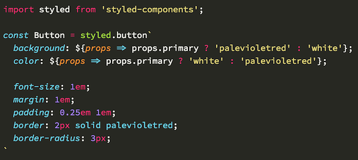

# Visual Studio Code

## Plugins

### [Auto Rename Tag](https://marketplace.visualstudio.com/items?itemName=formulahendry.auto-rename-tag)

此扩展自动重命名成对标签，可以使用以下方式针对不同文件配置


json 配置

```json
"auto-rename-tag.activationOnLanguage": [
    "html",
    "javascript",
    "javascriptreact"
]
```

### [Bracket Pair Colorizer](https://marketplace.visualstudio.com/items?itemName=CoenraadS.bracket-pair-colorizer)

此扩展允许用颜色标识成对的符号`()`,`[]`,`{}`


json 配置括号突出显示

```json
"editor.matchBrackets": "never", // 关闭vscode自带的括号显示
"bracketPairColorizer.highlightActiveScope": true // 开启插件括号突出显示
```


在左侧行号位置显示括号范围【针对括号比较长时非常有用】

```json
"bracketPairColorizer.showBracketsInGutter": true
```


在方括号直接显示水平线，默认启用

```json
"bracketPairColorizer.showHorizontalScopeLine"
```


### [change-case](https://marketplace.visualstudio.com/items?itemName=wmaurer.change-case)

此扩展快速更改当前选择单词的大小写


### [Code Runner](https://marketplace.visualstudio.com/items?itemName=formulahendry.code-runner)

此扩展可在编辑器中直接运行指定的代码，支持众多语言

### [Code Spell Checker](https://marketplace.visualstudio.com/items?itemName=streetsidesoftware.code-spell-checker)

此扩展单词拼写检查器【开发过程检查单词错误非常有用】


还可给出建议


### [css-triggers](https://marketplace.visualstudio.com/items?itemName=kisstkondoros.csstriggers)

此扩展对 CSS 属性进行说明


### [DotENV](https://marketplace.visualstudio.com/items?itemName=mikestead.dotenv)

此扩展 env 文件高亮


### [EditorConfig for VS Code](https://marketplace.visualstudio.com/items?itemName=EditorConfig.EditorConfig)

此扩展通过配置文件`.editorconfig`是编辑器约束一些编码行为

- indent_style
- indent_size
- tab_width
- end_of_line (on save)
- insert_final_newline (on save)
- trim_trailing_whitespace (on save)

### [Emoji](https://marketplace.visualstudio.com/items?itemName=Perkovec.emoji)

表情包


### [ES7 React/Redux/GraphQL/React-Native snippets](https://marketplace.visualstudio.com/items?itemName=dsznajder.es7-react-js-snippets)

此扩展提供 ES7 中的 JavaScript 和 React / Redux 片段，以及针对 VS Code 的 Babel 插件功能【很 6】

### [ESLint](https://marketplace.visualstudio.com/items?itemName=dbaeumer.vscode-eslint)

此扩展代码规则检查工具，通过`.eslintrc`配置文件配置规则

下面的设置为包括 ESLint 在内的所有提供程序打开“自动修复”：

```javascript
"editor.codeActionsOnSave": {
    "source.fixAll": true
}
```

相反，此配置仅在 ESLint 上将其打开：

```javascript
"editor.codeActionsOnSave": {
    "source.fixAll.eslint": true
}
```

可以通过以下方式有选择地禁用 ESLint：

```json
"editor.codeActionsOnSave": {
    "source.fixAll": true,
    "source.fixAll.eslint": false
}
```

### [Git History](https://marketplace.visualstudio.com/items?itemName=donjayamanne.githistory)

[可使用 GitLens 代替](https://marketplace.visualstudio.com/items?itemName=eamodio.gitlens)

此扩展查看 git 日志，文件历史记录，比较分支或提交

可用命令

- 查看 Git 历史记录（git 日志）（git.viewHistory）
- 查看文件历史记录（git.viewFileHistory）
- 查看行历史记录（git.viewLineHistory）

> 注意：要查看其历史记录的文件，必须已经打开。

### [gitignore](https://marketplace.visualstudio.com/items?itemName=codezombiech.gitignore)

此扩展可帮助您处理`.gitignore`文件

> 启动命令面板（使用 Ctrl + Shift + P 或 F1 键）并开始输入 Add gitignore

### [GitLens — Git supercharged](https://marketplace.visualstudio.com/items?itemName=eamodio.gitlens)

此扩展众多 git 功能，查看[文档](https://marketplace.visualstudio.com/items?itemName=eamodio.gitlens)

### [Gitmoji Commit](https://marketplace.visualstudio.com/items?itemName=benjaminadk.emojis4git)

此扩展在 git commit 提交时附带表情


### [Highlight Matching Tag](https://marketplace.visualstudio.com/items?itemName=vincaslt.highlight-matching-tag)

此扩展高亮成对的 tag


### [htmltagwrap](https://marketplace.visualstudio.com/items?itemName=bradgashler.htmltagwrap)

此扩展包装选择的 html 内容，按“ Alt + W”（对于 Mac，则为“ Option + W”）

### [Image preview](https://marketplace.visualstudio.com/items?itemName=kisstkondoros.vscode-gutter-preview)

此扩展在引用图片的地方悬停时可预览


### [indent-rainbow](https://marketplace.visualstudio.com/items?itemName=oderwat.indent-rainbow)

此扩展是缩进着色


### [Log File Highlighter](https://marketplace.visualstudio.com/items?itemName=emilast.LogFileHighlighter)

此扩展 log 日志文件高亮

### [Markdown All in One](https://marketplace.visualstudio.com/items?itemName=yzhang.markdown-all-in-one)

此扩展 Markdown 工具

### [markdownlint](https://marketplace.visualstudio.com/items?itemName=DavidAnson.vscode-markdownlint)

此扩展 Markdown lint 工具

### [npm](https://marketplace.visualstudio.com/items?itemName=eg2.vscode-npm-script)

此扩展检查`package.json`文件安装依赖及运行`npm`脚本


### [open in browser](https://marketplace.visualstudio.com/items?itemName=techer.open-in-browser)

此扩展在指定浏览器打开 html 文件

### [Path Intellisense](https://marketplace.visualstudio.com/items?itemName=christian-kohler.path-intellisense)

此扩展智能路径

### [Prettier - Code formatter](https://marketplace.visualstudio.com/items?itemName=esbenp.prettier-vscode)

此扩展是代码格式化工具

### [Project Manager](https://marketplace.visualstudio.com/items?itemName=alefragnani.project-manager)

此扩展是项目管理工具

### [SCSS IntelliSense](https://marketplace.visualstudio.com/items?itemName=mrmlnc.vscode-scss)

此扩展扫描工作空间中所有文件的 SCSS IntelliSense（变量，混入和函数）

### [Search node_modules](https://marketplace.visualstudio.com/items?itemName=jasonnutter.search-node-modules)

此扩展搜索当想项目下 node_modules 中的模块

### [Settings Sync](https://marketplace.visualstudio.com/items?itemName=Shan.code-settings-sync)

此扩展可同步 vscode 配置，插件到 GitHub Gist

### [TabNine](https://marketplace.visualstudio.com/items?itemName=TabNine.tabnine-vscode)

此扩展智能提示完成

### [TODO Highlight](https://marketplace.visualstudio.com/items?itemName=wayou.vscode-todo-highlight)

此扩展`TODO:`高亮

### [Turbo Console Log](https://marketplace.visualstudio.com/items?itemName=ChakrounAnas.turbo-console-log)

此扩展通过自动执行写入有意义的日志消息的操作，此扩展使调试变得更加容易。

快捷键

- 选中变量输出 log：`alt + shift + L`
- 删除 log：`alt + shift + D`
- 注释 log：`alt + shift + C`
- 删除注释 log：`alt + shift + U`

### [Vetur](https://marketplace.visualstudio.com/items?itemName=octref.vetur)

写 vue 必备插件

### [Better Comments](https://marketplace.visualstudio.com/items?itemName=aaron-bond.better-comments)

此扩展方便的区分注释内容


### [VS Code CSS Comments](https://marketplace.visualstudio.com/items?itemName=ashhitch.vs-code-css-comments)

此扩展写 CSS 注释更容易

### [vscode-faker](https://marketplace.visualstudio.com/items?itemName=deerawan.vscode-faker)

此扩展可以快速生成假数据


### [vscode-fileheader](https://marketplace.visualstudio.com/items?itemName=mikey.vscode-fileheader)

此扩展在文件标题中添加注释，并支持自动更新文件的修改时间


### [vscode-styled-components](https://marketplace.visualstudio.com/items?itemName=jpoissonnier.vscode-styled-components)

语法突出显示和样式组件的 IntelliSense



### [webpack](https://marketplace.visualstudio.com/items?itemName=jeremyrajan.webpack)

此扩展附带 webpack 使用

### [Document This](https://marketplace.visualstudio.com/items?itemName=joelday.docthis)

此扩展可以自动为 TypeScript 和 JavaScript 文件生成详细的 JSDoc 注释


### [Trailing Spaces](https://marketplace.visualstudio.com/items?itemName=shardulm94.trailing-spaces)

此扩展匹配空格着色突出显示

### [CSS Peek](https://marketplace.visualstudio.com/items?itemName=pranaygp.vscode-css-peek)

此扩展跳转到 CSS 定义

### [GraphQL for VSCode](https://marketplace.visualstudio.com/items?itemName=kumar-harsh.graphql-for-vscode)

此扩展用于 GraphQL 功能

### [Vscode Google Translate](https://marketplace.visualstudio.com/items?itemName=funkyremi.vscode-google-translate)

此扩展可翻译指定内容

## Shortcut keys

- 打开命令模式：`cmd + shift + P`或`F1`
- 在当前工作区搜索文件：`cmd + P`
- 打开快捷键映射面板：`cmd + K + S`
- 侧边栏可见性：`cmd + B`
- 一次搜索所有文件：`cmd + shift + F`
- 在所有文件中搜索替换：`cmd + shift + H`
- 重新打开关闭的编辑页面：`cmd + shift + T`
- 删除上一个单词：`alt + delete`
- 删除整行：`cmd + delete`
- 逐个选择文本：`alt + shift + 左右箭头`
- 选择整行文本：`cmd + shift + 左右箭头`
- 复制行：`alt + shift + 下箭头`
- 移动光标到整行左右侧：`cmd + 左右箭头`
- 移动光标到单词左右侧：`alt + 左右箭头`
- 重新加载窗口（保持关闭之前的状态）：`cmd + shift + P`输入`Reload Window`
- 通过匹配文本打开对应文件：`cmd + T`
- 批量替换当前文件中所有匹配的文本：`cmd + F2`
- 选择已选择内容所有项：`cmd + shift + L`，与上一个相同
- 向上/向下移动一行：`alt + 上下箭头`
- 复制光标向上或向下批量添加修改内容：`cmd + alt + 上下箭头`
- 跳转到指定行：`ctrl + G`

## Experience

### Emmet 的应用

快速输入 HTML

- 元素(Elements)：生成一个 HTML 元素
- `>` ：生成子元素
- `+` ：生成元素的兄弟节点
- `*` ：生成多个相同的元素
- 你可以 . 或者 # 来修饰元素，给元素加上 class 或者 id

比如我们输入`div.test>h3.title+ul>li*3>span.text`

有些 HTML 元素有许多的属性，在输入的过程中，通过在标签后面加上 :属性名 就指定了元素的属性。`input:password`

快速输入 CSS

对于一些属性的名称较短的，例如：display 与 visibility，输入属性首字母与值的首字母即可。比如：df 是 display: block; ，dn 是 display: none;。

对于一些属性的值是数值，例如：padding，margin，left，width 等，输入属性首字母与值即可。比如，m1 是 margin: 1px;。单位默认是 px，不过你可以指定一下单位，比如：w2vw 就是 width: 2vw;。当值是百分比时比较特殊，字母 p 代表 %，比如：w5p 就是 width: 5%;。

名称较长的属性往往含有连字符（-），输入连字符前后两个单词的首字母再加上值即可。比如：pt10 是 padding-top: 10px;。
