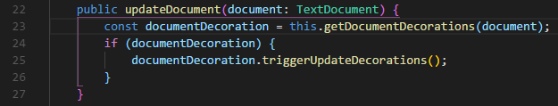
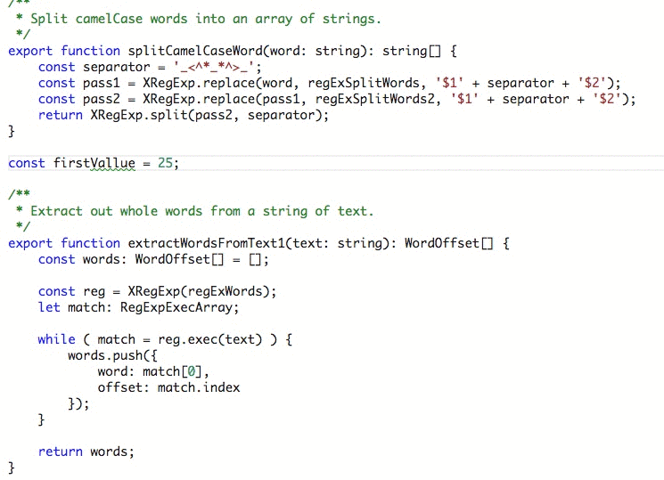

# Visual Studio Code

## Plugins

### [Auto Rename Tag](https://marketplace.visualstudio.com/items?itemName=formulahendry.auto-rename-tag)

此扩展自动重命名成对标签，可以使用以下方式针对不同文件配置


```json
"auto-rename-tag.activationOnLanguage": [
    "html",
    "javascript",
    "javascriptreact"
]
```

### [Bracket Pair Colorizer](https://marketplace.visualstudio.com/items?itemName=CoenraadS.bracket-pair-colorizer)

此扩展允许用颜色标识成对的符号`()`,`[]`,`{}`



- 设置括号突出显示

  ```json
  "editor.matchBrackets": "never", // 关闭vscode自带的括号显示
  "bracketPairColorizer.highlightActiveScope": true // 开启插件括号突出显示
  ```

  

- 在左侧行号位置显示括号范围【针对括号比较长时非常有用】

  ```json
  "bracketPairColorizer.showBracketsInGutter": true
  ```

  

- 在方括号直接显示水平线，默认启用

  ```json
  "bracketPairColorizer.showHorizontalScopeLine"
  ```

  

### [change-case](https://marketplace.visualstudio.com/items?itemName=wmaurer.change-case)

此扩展快速更改当前选择单词的大小写


### [Code Runner](https://marketplace.visualstudio.com/items?itemName=formulahendry.code-runner)

此扩展可在编辑器中直接运行指定的代码，支持众多语言

### [Code Spell Checker](https://marketplace.visualstudio.com/items?itemName=streetsidesoftware.code-spell-checker)

此扩展单词拼写检查器【开发过程检查单词错误非常有用】



还可给出建议


### [css-triggers](https://marketplace.visualstudio.com/items?itemName=kisstkondoros.csstriggers)

此扩展对 CSS 属性进行说明


### [DotENV](https://marketplace.visualstudio.com/items?itemName=mikestead.dotenv)

此扩展 env 文件高亮


### [EditorConfig for VS Code](https://marketplace.visualstudio.com/items?itemName=EditorConfig.EditorConfig)

此扩展通过配置文件`.editorconfig`是编辑器约束一些编码行为

- indent_style
- indent_size
- tab_width
- end_of_line (on save)
- insert_final_newline (on save)
- trim_trailing_whitespace (on save)

### [Emoji](https://marketplace.visualstudio.com/items?itemName=Perkovec.emoji)

表情包


### [](https://marketplace.visualstudio.com/items?itemName=dsznajder.es7-react-js-snippets)

此扩展提供 ES7 中的 JavaScript 和 React / Redux 片段，以及针对 VS Code 的 Babel 插件功能【很 6】

### [ESLint](https://marketplace.visualstudio.com/items?itemName=dbaeumer.vscode-eslint)

此扩展代码规则检查工具，通过`.eslintrc`配置文件配置规则

下面的设置为包括 ESLint 在内的所有提供程序打开“自动修复”：

```javascript
"editor.codeActionsOnSave": {
    "source.fixAll": true
}
```

相反，此配置仅在 ESLint 上将其打开：

```javascript
"editor.codeActionsOnSave": {
    "source.fixAll.eslint": true
}
```

您还可以通过以下方式有选择地禁用 ESLint：

```json
"editor.codeActionsOnSave": {
    "source.fixAll": true,
    "source.fixAll.eslint": false
}
```

### [Git History](https://marketplace.visualstudio.com/items?itemName=donjayamanne.githistory)

[可使用 GitLens 代替](https://marketplace.visualstudio.com/items?itemName=eamodio.gitlens)

此扩展查看 git 日志，文件历史记录，比较分支或提交

可用命令

- 查看 Git 历史记录（git 日志）（git.viewHistory）
- 查看文件历史记录（git.viewFileHistory）
- 查看行历史记录（git.viewLineHistory）

> 注意：要查看其历史记录的文件，必须已经打开。

### [gitignore](https://marketplace.visualstudio.com/items?itemName=codezombiech.gitignore)

此扩展可帮助您处理`.gitignore`文件

> 启动命令面板（使用 Ctrl + Shift + P 或 F1 键）并开始输入 Add gitignore

### [GitLens — Git supercharged](https://marketplace.visualstudio.com/items?itemName=eamodio.gitlens)

此扩展众多 git 功能，查看[文档](https://marketplace.visualstudio.com/items?itemName=eamodio.gitlens)

## Shortcut keys

- 当前文件替换：`cmd + alt + F`
- 在所有文件中搜索替换：`cmd + shift + H`

## Experience
