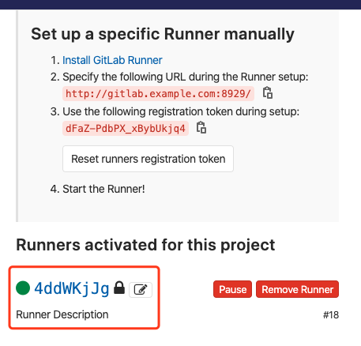
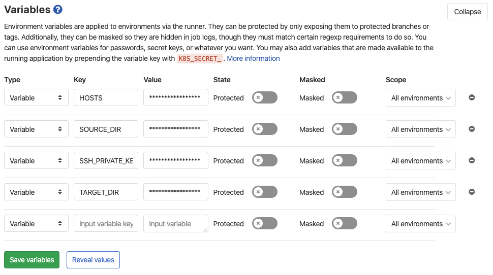

# Gitlab + Gitlab Runner

## 安装

## 注册

```bash
gitlab-runner register
```

之后是 QA 式操作，按照提示内容输入，可参考[官网操作](https://docs.gitlab.com/runner/register/)

或者直接通过命令行设置参数，比较方便

```bash
gitlab-runner register -n \
   --url http://gitlab.example.com:8929/ \
   --registration-token dFaZ-PdbPX_xBybUkjq4 \
   --executor docker \
   --description "Runner Description" \
   --tag-list "docker" \
   --docker-image "node:10.16.3-alpine" \
   --docker-volumes /var/run/docker.sock:/var/run/docker.sock \
   --docker-extra-hosts "gitlab.example.com:172.21.0.3" \
   --docker-network-mode gitlab_gitlab-network
```

注意：

- `url`：gitlab 地址
- `registration-token`：在 gitlab 项目中`settings->CI/CD->Runners->Set up a specific Runner manually->token`
- `executor`：执行器选择`docker`或者`shell`
- `description`：当前执行器描述
- `tag-list`：tags
- `docker-image`：如果`executor`选择`docker`，设置`image`
- `docker-volumes`：如果`executor`选择`docker`，把`gitlab-runner`机器上的`docker`功能链接进新启动的`container`
- `docker-extra-hosts`：写入额外的`host`内容
- `docker-network-mode`设置新启动`docker container`的`network`，方便与其他容器链接

注册成功后，看到下图就说明配置成功了



## ssh 免密登录

### 为什么需要免密码登录

- 构建产出的 build 文件要传输到目标服务器（测试机/生成机），要么基于 http 网络协议、要么基于 ssh 协议（或其他文件传输协议？）
- 基于 http 需要写文件接收接口，这里直接使用基于 ssh 传输文件的 rsync，简单、安全！
- runner 内定义的一系列 script 是在一个 docker 容器内执行的，无法人工干预，那么登录服务器就要做成免密。

### 生成一对公私钥

在 runner 机器上执行，使用 rsa 作为非对称加密方式：

```bash
ssh-keygen -t rsa -C "$(whoami)@$(hostname)-$(date -I)"
```

> 一路 enter 就好了，如果你非要加个 password，对不起，没救了！

### 免密码登录

免密登录的精髓就是：把本机的公钥存储到目标服务器的 authorized_keys 文件内（该文件服务器上不存在可以直接创建。）

```bash
ssh-copy-id -i ~/.ssh/id_rsa.pub username@ip
```

这时可以到远程服务器下 username/.ssh/authorized_keys 查看该文件

> 如果你的端口不是默认的 22 端口，则加上端口号 -p PORT。

### 验证登录

```bash
ssh username@ip
```

> 如果你的端口不是默认的 22 端口，则加上端口号 -p PORT。

不出意外，你应该可以直接登录服务器了。

## 测试 rsync 传输文件

在 runner 机器上新建 index.html，传输到远程服务器指定路径

```bash
rsync -rav --delete index.html username@ip:username/site/
```

> 注意：可能会遇到权限问题，所以确保远程服务器路径具有当前 username 权限

## gitlab 仓库配置变量

在`gitlab仓库->settings->CI/CD->Variables`设置几个变量，下面`.gitlab.yml`会用到。



- `SSH_PRIVATE_KEY`：把本机（runner 所在机器）生成的私钥复制到新容器内
- `USER`：主机用户名
- `HOSTS`：远程主机 IP
- `SOURCE_DIR`：需要复制的目录（当前 git 目录作相对路径）
- `TARGET_DIR`：远程主机目录位置

## gitlab runner 配置

先项目根目录新建`.gitlab.yml`文件，写入以下内容

```yml
default:
  before_script:
    - whoami
    - pwd
    - echo $CI_PROJECT_DIR

cache:
  paths:
    - node_modules
    - package-lock.json

stages:
  - install_dep
  - test
  - build
  - deploy

install_dep_job:
  stage: install_dep
  script:
    - npm config set registry https://registry.npm.taobao.org
    - npm install --progress=false

test_job:
  stage: test
  script:
    - echo 'Running Test Script'
    - npm run test
    - echo 'End Test Script'

build_job:
  stage: build
  artifacts:
    expire_in: 1 week
    paths:
      - build
  script:
    - echo 'Running Build Script'
    - npm run build
    - echo 'End Build Script'

deploy_job:
  stage: deploy
  environment:
    name: prod_deploy
    url: https://github.com/
  dependencies:
    - build_job
  before_script:
    - echo 'Set Repositories'
    - echo 'https://mirrors.aliyun.com/alpine/v3.9/main' > /etc/apk/repositories
    - echo 'https://mirrors.aliyun.com/alpine/v3.9/community' >> /etc/apk/repositories
    - echo 'End Repositories'
    - apk add --no-cache rsync openssh
    - mkdir -p ~/.ssh
    - echo "$SSH_PRIVATE_KEY" >> ~/.ssh/id_rsa
    - chmod 600 ~/.ssh/id_rsa
    - echo -e "Host *\n\tStrictHostKeyChecking no\n\n" > ~/.ssh/config
  script:
    - echo 'Running Deploy Script'
    - rsync -rav --delete $SOURCE_DIR $USER@$HOSTS:$TARGET_DIR
    - echo 'End Deploy Script'
```

其中`$SSH_PRIVATE_KEY`，`$SOURCE_DIR`，`$USER`，`$HOSTS`，`$TARGET_DIR`都是上面配置的变量，`$CI_PROJECT_DIR`是[gitlab 内置变量](https://docs.gitlab.com/ee/ci/variables/predefined_variables.html)

配置说明：

- `stages`定义总共三个阶段`test`，`build`，`deploy`。
- `cache`设置缓存文件，这里缓存 node_modules 依赖包，提高 job 构建效率，定义在全局对所有 job 都生效。
- `artifacts`定义编译生成的 build 文件缓存到 gitlab 服务器，并提供下载或者各个 job 之间共享。
- `dependencies`依赖的 job。
- `before_script`定义的脚本在 script 之前执行。
